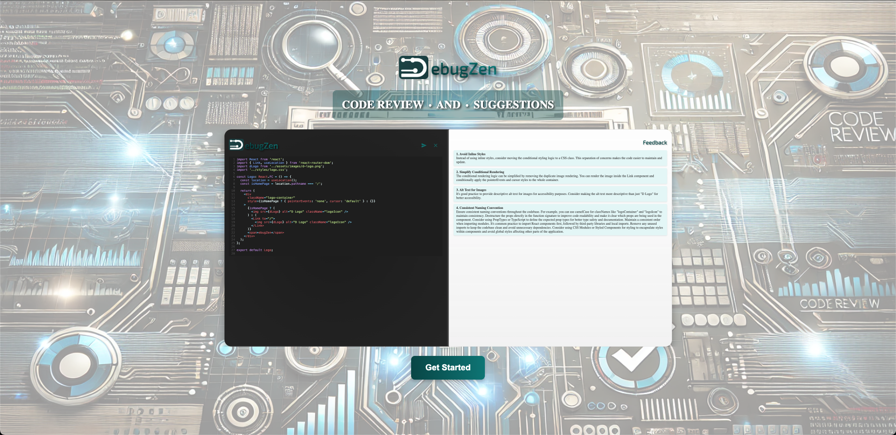
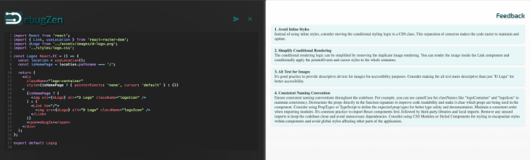

# DebugZen Frontend

DebugZen Frontend is a React-based web interface for submitting and analyzing code snippets using [DebugZen's AI-powered backend](https://github.com/tbourn/debugzen-backend)

---

## Features

- **Code Editor**: An interactive editor with syntax highlighting (powered by CodeMirror).
- **Feedback Display**: Dynamic and AI-powered feedback for submitted code snippets.
- **Resizable Panes**: Adjustable layout for better user experience.
- **Custom Hooks**: Modular and reusable logic for managing state and components.
- **Responsive Design**: Optimized for both desktop and mobile views.

---

## Architecture

- **Components**: Reusable UI elements for home, review, and feedback sections.
- **Hooks**: Encapsulates reusable logic for state management and interactivity.
- **Styles**: Organized modular CSS files for consistent theming and design.
- **Assets**: Contains static assets like images and logos.

---

## Prerequisites

1. **Node.js**: Install [Node.js](https://nodejs.org/).
2. **Environment Variables**: Create a `.env` file in the root:
   - `VITE_API_URL`: The base URL for the backend API (e.g., `http://localhost:8080`).

---

## Setup Instructions

### Clone the Repository

```bash
git clone https://github.com/tbourn/debugzen-frontend.git
cd debugzen-frontend
npm install
npm run start
```

## Components

### Editor

- **Description**: Code editor component with syntax highlighting and submit functionality.
- **Integration**: Connects to the backend API to submit and fetch feedback.

### Feedback

- **Description**: Displays structured feedback from the backend.
- **Dynamic Rendering:**: Updates in real-time based on the API response.

### Logo

- **Description**: Displays the application logo with gradient styling.

## Custom Hooks

### useCodeState

- **Purpose**: Manages the editor’s state, including code input, feedback, and loading states.
- **Integration**: Handles API communication for code submission.

### useResizablePane

- **Purpose**: Adds functionality for resizing the editor and feedback panes.

### useCarousel

- **Purpose**: Implements an image carousel for the home page.

## Screenshots

### Home Screen



### Application Flow


